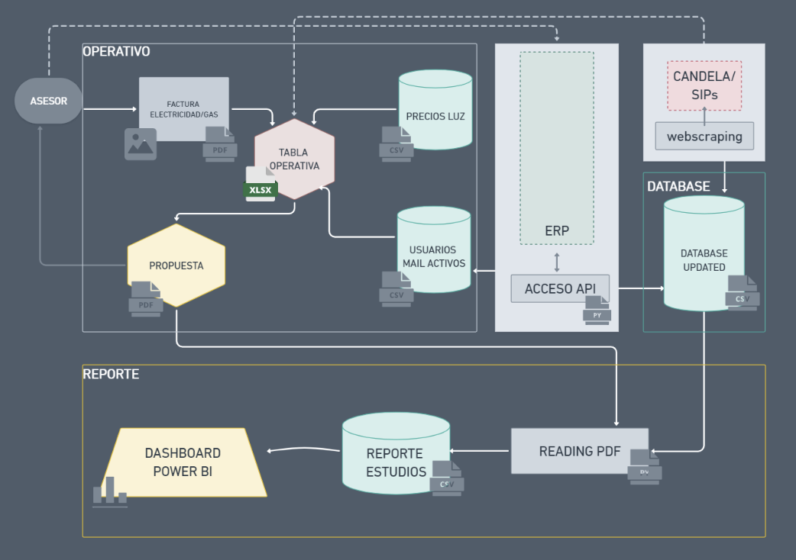
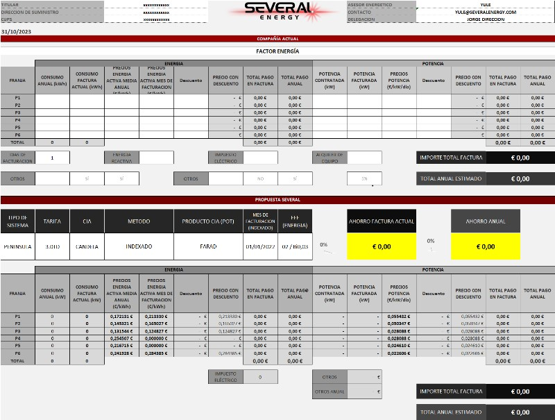
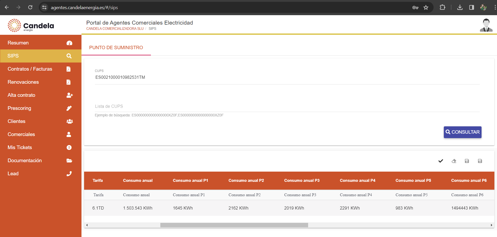
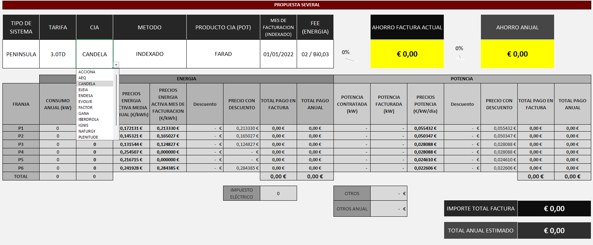
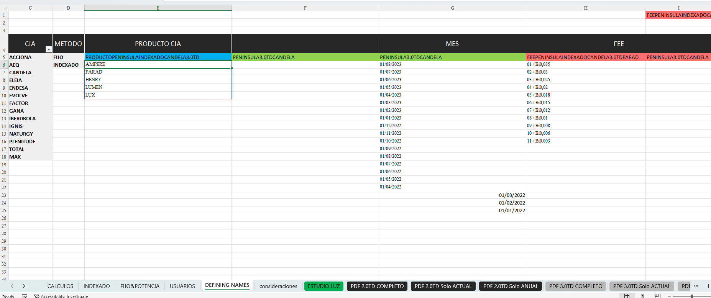
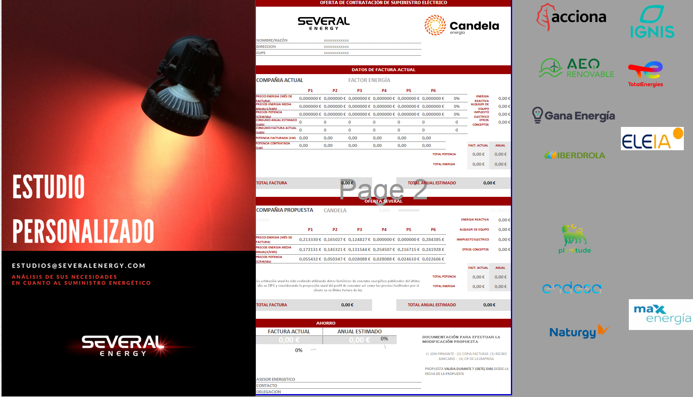

# Comparador de Suministro Energético

El comparador tiene como objetivo evaluar las diferencias contractuales en el suministro energético, tanto de gas como de electricidad. En este documento, nos centraremos exclusivamente en la electricidad. 

Se analiza el perfil de consumo anual y horario del cliente, además de comparar los importes de €/kWh consumidos y €/kW/día contratados actualmente con las tarifas disponibles proporcionadas por la asesoría.

* [Flujo de Trabajo Actual](#flujo-de-trabajo-actual)
Directorios en este repositorio:
  - [1. Operativo](#1-operativo)
  - [2. Base de Datos](#2-base-de-datos)
  - [3. Reporte](#3-reporte)

* [Tabla Operativa](#tabla-operativa)

* [Problematica](#)

* [Propuesta Web](#propuesta-web)

# Flujo de Trabajo Actual
---

En la actualidad, la calculadora comparativa se basa en un archivo XLMS sin dependencias externas ni enlaces. Todos los datos y fórmulas se encuentran dentro del archivo y se actualizan con archivos auxiliares. La actualización es hecha esporádicamente reflejando los cambios de las comercializadoras y periódicamente con los datos del ERP.

### 1. Operativo

Este directorio proporciona acceso al operador del [workbook de estudios](Operativo\SEVERAL\ESTUDIOPERSONALIZADO_SEVERAL_USUARIO_17.10.23.xlsx). Esta persona es responsable de operar diariamente los workbooks de estudios y de actualizar el archivo [PRECIOS LUZ](Operativo\PRECIOS_LUZ.xlsx) una vez llega la notificacion de la comercializadora. Estos datos se utilizan posteriormente para la actualización manual de la calculadora. El archivo [USUARIOS_EMAIL_ACTIVOS](Operativo\USUARIOS__EMAIL_ACTIVOS.xlsx) también sirve como referencia para la actualización del workbook, y se actualiza semanalmente con los datos del ERP.

Todos los estudios se almacenan en un sharepoint al final del dia para posterior reporte [ESTUDIOS PDF](Operativo\ESTUDIOS_PDF).

### 2. Base de Datos

Semanalmente, accedemos a la API del ERP a través de un script de Python y descargamos y procesamos la base de datos con los estados actuales de las operaciones. Este proceso también incluye la incorporación de nuevos usuarios en [USUARIOS_EMAIL_ACTIVOS](Operativo\USUARIOS__EMAIL_ACTIVOS.xlsx). Además incorporamos datos SIPs con un webscraping a la intranet de candela (este proceso aun tiene limitaciones). Los datos dispuestos son: [id_erp', 'concepto_tarifa_strip', 'consumo_erp',
       'cups20', 'fecha_ed', 'nodo', 'direccion', 'cp', 'poblacion',
       'provincia', 'tarifa_erp', 'tipo', 'comercial', 'equipo', 'CNAE',
       'Codigo Autoconsumo', 'Codigo TensionV', 'Consumo_sips',
       'Consumo Anual P1', 'Consumo Anual P2', 'Consumo Anual P3',
       'Consumo Anual P4', 'Consumo Anual P5', 'Consumo Anual P6',
       'Es Vivienda Habitual', 'Potencias Contratadas En W P1',
       'Potencias Contratadas En W P2', 'Potencias Contratadas En W P3',
       'Potencias Contratadas En W P4', 'Potencias Contratadas En W P5',
       'Potencias Contratadas En W P6', 'TITULO_CNAE2009'].

### 3. Reporte 

Cada semana se actualiza el [reporte](Reporte\reporte_estudios.xlsx) de los estudios mediante la ejecución de un [script](Reporte\reading_pdf_reporting_estudios.ipynb) en Python, que realiza las siguientes tareas:

- Extrae información de los estudios en formato PDF y la transfiere a un dataframe de Pandas.
- Recopila información de la base de datos del CRM.
- Integra ambos conjuntos de datos.
- Exporta los datos procesados a un archivo de Excel.

Este archivo Excel se importa a [PowerBi](Reporte\Reporte_Estudios_comparativos.pbix) para su análisis gráfico en el panel de control.

# Tabla Operativa
---
## "FRONTEND"
Todos los campos en blanco son completados por el usuario. Los valores de las demás celdas son generados automaticamente.

#### COMPAÑÍA ACTUAL
***

Los datos en la sección "COMPAÑÍA ACTUAL" se obtienen de la factura y las condiciones contractuales actuales del cliente. 

Para los datos anuales consultamos el SIPS (El Sistema de Información de Puntos de Suministro) en la plataforma de nuestra comercializadora CANDELA ENERGIA con el CUPS (Código Universal de Punto de Suministro) del cliente .

Os libero acceso para probar acceder a vuestro punto de suministro:
> https://agentes.candelaenergia.es/#/login
Usuario:CA001507
Contraseña:CI001-507/258071

**El acceso a la plataforma deberá ser reponsable ya que los datos de consumo energético (de gas o electricidad) individualizados para cada punto de suministro, contenidos en el SIPS junto al código universal que identifica cada punto de suministro ("CUPS") son considerados datos personales, en cuanto se refieren a persona identificable. Por ello, estos datos que figuran en el SIPS se inscriben en el ámbito de aplicación de la Ley Orgánica 3/2018, de 5 de diciembre, de Protección de Datos Personales y garantía de los derechos digitales (LOPDGDD).**

***
#### PROPUESTA SEVERAL
*** 
En "PROPUESTA SEVERAL", el usuario tiene un menú desplegable con las posibles ofertas disponibles. Los precios y otros importes se generan automáticamente a partir de esta selección.

## "Backend"
Las tablas con los precios, todos los comandos y calculos estan en hojas ocultas.

## "Output"
Una vez que se define la oferta, se genera la propuesta en formato PDF. 

 En esta versión, para obtener el PDF, es necesario navegar hasta la hoja de la tarifa correspondiente al tipo de propuesta que se desea presentar.  Existe una versión con la impresión automática configurada mediante una macro que se activa a través de un botón, pero no es compatible con la versión web.
# Problematica

Aunque el workbook sea 100% funcional en las operaciones internas del backoffice con las aplicaciones Windows 360 en cuenta paga, se han identificado limitaciones con el uso externo. En la app web por ejemplo no funciona algunas macros y se desconfigura los ajustes de páginas, ya en la app desktop algunas fórmulas no resultan compatibles con determinadas versiones de la aplicacion excel.

La creciente demanda de uso tambien ha suscitado la necesidad de virtualizar y automatizar todo lo que sea posible para ahorrar tiempo de generación de propuesta.

Esas problematicas han dado lugar a la propuesta de reemplazar la hoja de cálculo Excel por una web app.

# Propuesta Web
---

La versión inicial (fase 1) que implica el desafio de tripulaciones de TheBridge se limitará en:

Desarrollar un MVP que replique la funcionalidad actual del workbook.

- UX/UI: Establecer la mejor linea de uso de la aplicación, haciendo que la introducción de datos del cliente y la definición de la oferta sean más intuitivas, con una interfaz amigable y moderna.
- FULLSTACK: Desarrollar una webApp de acuerdo con lo definido por UX/UI donde los asesores puedan logar, introducir datos de la factura y sacar sus comparativas en PDF.
- MARKETING DIGITAL: Establecer una estructura de campaña para la parte de negocio de atraer nuevos asesores energeticos interesados en el uso de la plataforma.
- CIBERSEGURIDAD: Tener en cuenta los mínimos de seguridad que deben ser parte del proyecto tanto en el nivel usuario y la propia app, como en los datos manejados.
- CLOUD: Concebir la arquitectura en la nube con desencadenadores para que la actualización sea automática con la carga de datos. 
- DATA SCIENCE: Establecer mejorias en el sistema de data analisis y/o proponer un algoritmo para predecir precios en el mercado indexado (Actualmente la propuesta anual la hacemos con la media del mercado indexado del ultimo año).

## What is next?

-Fase 2 introducción automática del consumo y demanda del cliente mediante acceso al SIPs.

-Fase 3 introducción automática de los datos de las condiciones contractuales actuales del cliente con un upload de la factura en formato PDF/imagen. Es importante destacar la complejidad de esta característica, ya que las facturas varían en formato según la compañía.

